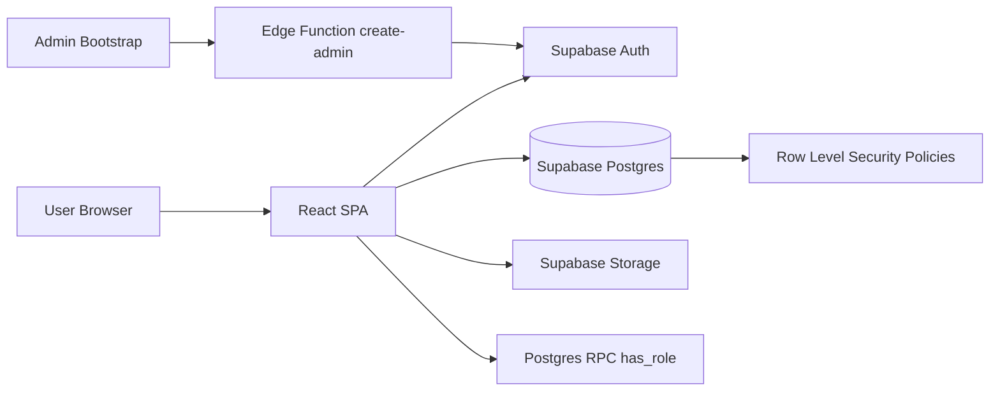
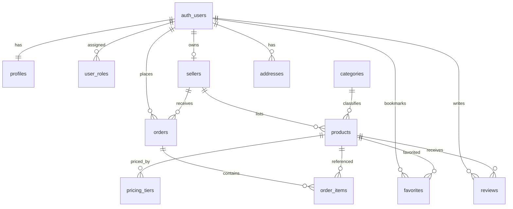

# Duniya Mart System Design

## 1. Objective and Scope
This document defines the system design for the **Duniya Mart** project, based on the current implementation in the repository.

The platform is a multi-role grocery marketplace with:
- Public catalog browsing
- Buyer purchase flow (cart, checkout, order tracking)
- Seller operations (catalog + fulfillment)
- Admin operations (approval, moderation, taxonomy, coupons)

## 2. Requirements

### 2.1 Functional Requirements
1. User authentication and role-aware access (`buyer`, `seller`, `admin`).
2. User profile management (name, phone, avatar).
3. Seller onboarding with approval lifecycle (`pending`, `approved`, `rejected`, `suspended`).
4. Product catalog browsing with search, category filtering, sorting, and product details.
5. Tiered pricing by quantity (MOQ and bulk pricing).
6. Cart management: add/update/remove items, grouped by seller, dynamic tier pricing.
7. Address management for buyers.
8. Coupon validation and discount application.
9. Order placement that splits cart into seller-specific orders.
10. Buyer dashboard for order history, wishlist, addresses, and profile.
11. Seller dashboard for product CRUD, order status updates, and store settings.
12. Admin dashboard for seller approval, product moderation, coupon/category management, and marketplace KPIs.
13. Media upload for avatars, seller assets, and product images.

### 2.2 Non-Functional Requirements
1. Role-based data isolation and least-privilege access via RLS.
2. Responsive web UI (mobile + desktop).
3. Low-latency list/detail reads using client caching (React Query).
4. Graceful error handling with user-friendly messages.
5. Maintainable domain model with typed Supabase schema.
6. Scalability through managed backend services (Supabase Postgres/Auth/Storage).

## 3. Technology Stack
- Frontend: React 18 + TypeScript + Vite
- UI: Tailwind CSS + shadcn/Radix components
- Routing: React Router v6
- Data Fetching: TanStack React Query
- Backend Platform: Supabase
  - Auth
  - Postgres (tables, enums, triggers, RLS)
  - Storage buckets
  - Edge Functions (admin bootstrap)
- Testing: Vitest + Testing Library (minimal baseline coverage currently)

## 4. High-Level Design (HLD)

### 4.1 Architecture Overview
The app follows a **frontend + Backend-as-a-Service** architecture. The browser client directly calls Supabase services.

### 4.2 Runtime Layers
1. Presentation Layer: pages/components and route navigation.
2. Client Domain Layer: auth/cart contexts, marketplace hooks, error mapping.
3. Data Access Layer: `supabase-js` client and typed schema contracts.
4. Platform Data Layer: relational schema + RLS + storage policies + triggers.

### 4.3 Role Access Model
- Buyer:
  - Public catalog read
  - Manage own profile, addresses, favorites, orders (create/view own)
- Seller:
  - Own seller profile updates
  - Own products and fulfillment operations
  - Read/update own orders
- Admin:
  - Full governance access via `has_role(auth.uid(), 'admin')`

## 5. Low-Level Design (LLD)

### 5.1 Frontend Internal Design

#### Core providers
- `AuthProvider`:
  - Tracks session/user
  - Fetches profile + roles from `profiles` and `user_roles`
  - Exposes auth methods and role helpers
- `CartProvider`:
  - In-memory cart state
  - Quantity-tier based pricing selection
  - Seller-wise grouping for checkout split

#### Marketplace data access
- `useProducts`, `useProduct`, `useSellers`, `useSeller`, `useCategories`
- Sources:
  - Primary: Supabase tables
  - Fallback: local `mockData` when DB returns empty/error

#### Major route groups
- Public storefront: home, product listing/detail, sellers, seller store
- Purchase flow: cart, checkout
- Account/Auth: login/signup
- Role dashboards: buyer/seller/admin

### 5.2 Backend Data Model

#### Core identity and role tables
- `profiles`
- `user_roles`
- Triggered user bootstrap via `handle_new_user()`
- Role function: `has_role(_user_id, _role)`

#### Commerce tables
- `sellers`
- `categories`
- `products`
- `pricing_tiers`
- `orders`
- `order_items`
- `addresses`
- `coupons`
- `favorites`
- `reviews`
- `messages`

#### Storage buckets
- `product-images`
- `seller-assets`
- `avatars`

### 5.3 Data Relationships (Simplified)

### 5.4 Security and Authorization
1. RLS enabled on business tables.
2. Public read allowed for catalog-like tables where intended (`products`, `categories`, `sellers`, etc.).
3. Self-service ownership checks for buyer/seller records.
4. Admin override policies centralized through `has_role`.
5. Storage write access constrained by authenticated user and folder prefix (`auth.uid()`).

### 5.5 Key Process Flows

#### A) Signup and role provisioning
1. User signs up with metadata (`role`, `full_name`, optional `business_name`).
2. DB trigger inserts `profiles` and role rows in `user_roles`.
3. If role is seller, `sellers` row is created in `pending` status.

#### B) Checkout and order split
1. Buyer confirms address and optional coupon.
2. Cart items grouped by seller.
3. One `orders` row per seller is inserted.
4. Each group inserts matching `order_items`.
5. Coupon usage counter increments.

#### C) Seller fulfillment
1. Seller sees only own orders.
2. Status transitions: `placed -> confirmed -> processing -> shipped -> delivered` (or `rejected`).
3. Tracking details saved on shipped orders.

## 6. Project Decomposition into 8 Modules (3 Frontend + 5 Backend)

### Frontend Modules (3)

| Module ID | Module Name | Responsibility | Key Files |
|---|---|---|---|
| FE-1 | Marketplace Experience | Public storefront, discovery, listing/detail, seller storefront | `src/pages/HomePage.tsx`, `ProductsPage.tsx`, `ProductDetailPage.tsx`, `SellersPage.tsx`, `SellerStorePage.tsx`, marketplace/layout components |
| FE-2 | Identity and Buyer Journey | Authentication, cart, checkout, buyer dashboard/profile/address/wishlist | `src/contexts/AuthContext.tsx`, `CartContext.tsx`, `LoginPage.tsx`, `SignupPage.tsx`, `CartPage.tsx`, `CheckoutPage.tsx`, `pages/buyer/BuyerDashboard.tsx` |
| FE-3 | Operations Console UI | Seller/admin dashboards, forms, moderation UI, store settings, uploads | `pages/seller/SellerDashboard.tsx`, `pages/admin/AdminDashboard.tsx`, `components/ImageUpload.tsx` |

### Backend Modules (5)

| Module ID | Module Name | Responsibility | Data/Artifacts |
|---|---|---|---|
| BE-1 | Identity and Access Control | Auth lifecycle, profile creation, role assignment, role checks | `profiles`, `user_roles`, `app_role`, `handle_new_user()`, `has_role()` |
| BE-2 | Catalog and Seller Management | Seller records, categories, product lifecycle, pricing tiers | `sellers`, `categories`, `products`, `pricing_tiers`, product/seller storage assets |
| BE-3 | Order and Checkout Engine | Addresses, order creation/splitting, order items, status transitions, tracking | `addresses`, `orders`, `order_items`, `order_status` |
| BE-4 | Engagement and Promotion | Favorites, reviews, messaging, coupon catalog and redemption counters | `favorites`, `reviews`, `messages`, `coupons` |
| BE-5 | Platform Security and Operations | RLS governance, storage policies, migration evolution, admin bootstrap | migration SQLs, storage policies, Edge function `create-admin` |

## 7. Interface Contracts (Current Pattern)
There is no separate custom REST server; the frontend performs table/RPC operations directly through Supabase client:
- Auth: `supabase.auth.signUp/signInWithPassword/signOut/getSession`
- CRUD/queries: `supabase.from(<table>).select/insert/update/delete`
- Storage: `supabase.storage.from(<bucket>).upload/getPublicUrl`
- RPC: `supabase.rpc("has_role", ...)`

## 8. Current Gaps and Design Risks
1. Hardcoded admin bootstrap credentials in edge function should be replaced by secure secret-driven flow.
2. Cart state is not persisted across refresh/login sessions.
3. Coupon usage update is non-atomic in checkout and may race under concurrency.
4. Product favorite button exists on card UI but add/remove favorite flow is not wired there.
5. Seller product form lacks direct management UI for multiple `pricing_tiers` (uses base price only).
6. Test coverage is minimal (single placeholder unit test).
7. Fallback to mock catalog data can mask production data failures.

## 9. Recommended Next Iteration
1. Introduce service-layer wrappers per module (FE + BE boundary abstraction).
2. Add transactional RPC for order placement + coupon decrement atomically.
3. Add persisted cart (local storage or server-side draft cart).
4. Implement pricing tier editor in seller console.
5. Expand tests: auth guards, checkout flow, RLS regression tests, dashboard CRUD.
